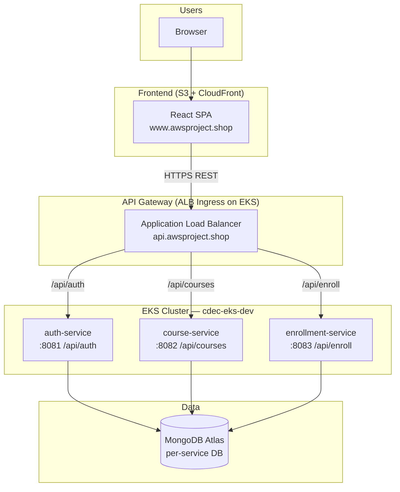
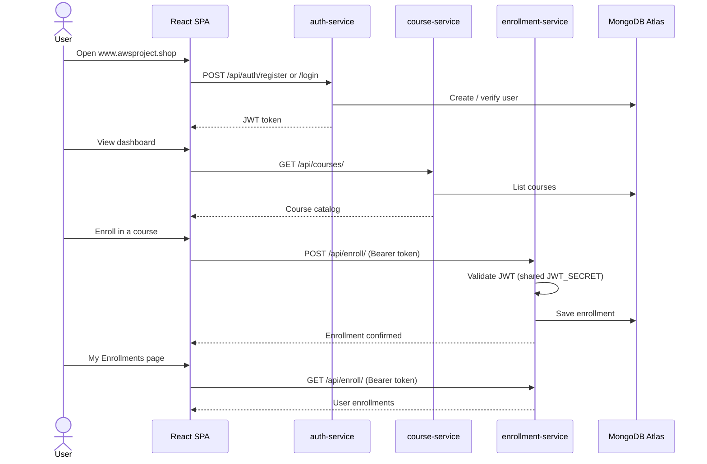
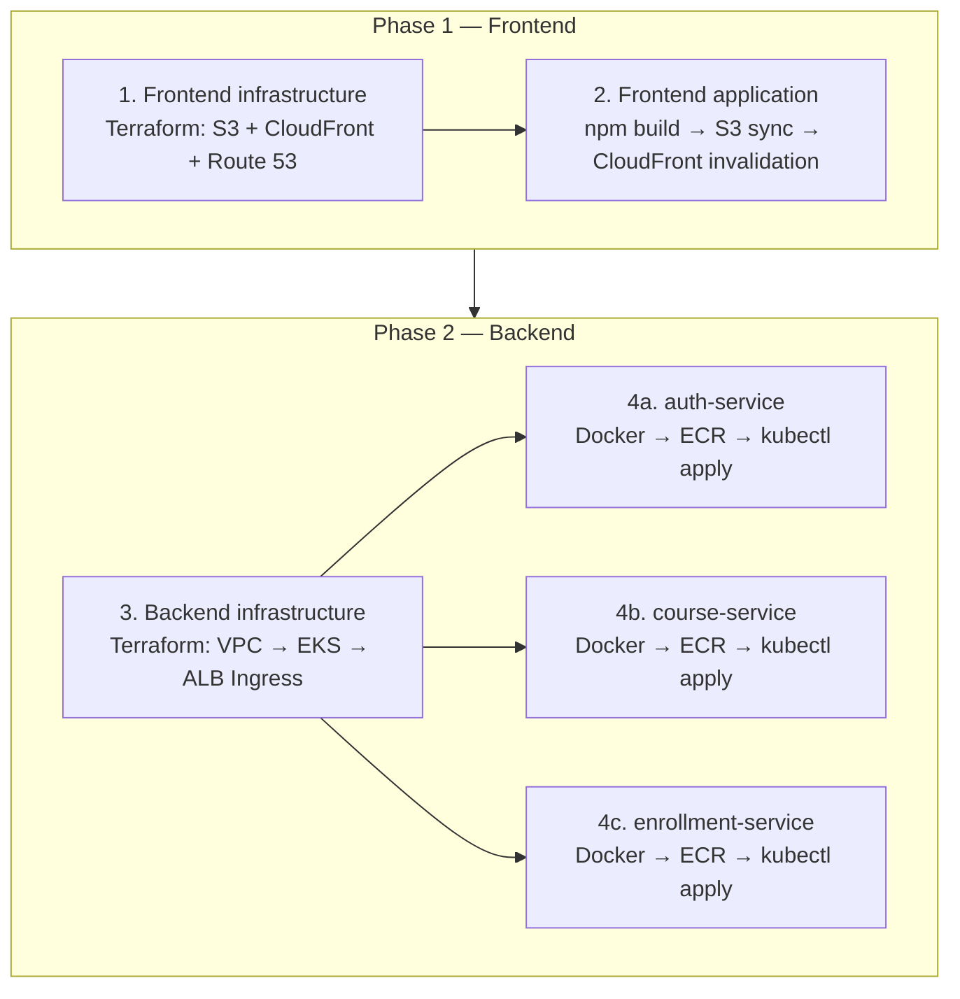

# CourseFlow — Cloud-Native Course Enrollment Platform

Course enrollment platform built as a React SPA with three Spring Boot microservices on AWS.

| Layer | Technology |
|-------|------------|
| Frontend | React 19, TypeScript, Vite, Tailwind CSS |
| Backend | Java 17, Spring Boot 3.2, MongoDB Atlas |
| Frontend hosting | S3 + CloudFront + Route 53 |
| Backend hosting | EKS, ALB Ingress, ECR |

## Environments (dev)

| Resource | Value |
|----------|-------|
| Region | `ap-southeast-2` |
| Frontend URL | `https://www.awsproject.shop` |
| API URL | `https://api.awsproject.shop` |
| EKS cluster | `cdec-eks-dev` |
| Terraform state bucket | `cdec-alpha-terraform-tfstate` |
| Frontend S3 bucket | `cdec-alpha-auto-dev-frontend` |
| CloudFront distribution ID | `E2PELF0TPMSLLU` |
| Jenkins AWS credential | `snehal-aws` |

> `.github/workflows/enrollment-service.yml` is currently configured against a **different** AWS account/region (`439055361064`, ECR in `ap-south-1`, EKS lookup in `eu-west-1`) than the values above. Reconcile this before relying on the GitHub Actions path for a live deploy — see [CI/CD pipelines summary](#cicd-pipelines-summary).

---

## Application architecture



### Request flow (user journey)



### API routing (ALB Ingress)

| Path prefix | Service | Port |
|-------------|---------|------|
| `/api/auth` | auth-service | 8081 |
| `/api/courses` | course-service | 8082 |
| `/api/enroll` | enrollment-service | 8083 |

Frontend build-time API URLs (baked into the SPA at build time):

| Variable | Production value |
|----------|------------------|
| `VITE_AUTH_API` | `https://api.awsproject.shop/api/auth` |
| `VITE_COURSE_API` | `https://api.awsproject.shop/api/courses` |
| `VITE_ENROLL_API` | `https://api.awsproject.shop/api/enroll` |

---

## First-time deployment order

Deploy in two phases. **Frontend first**, then **backend**. The UI can be live before APIs exist; API URLs are configured at build time.



---

## Phase 1 — Frontend infrastructure and application

### Step 1: Frontend infrastructure

**Directory:** `infrastructure/frontend/`
**Jenkins:** `infrastructure/frontend/Jenkinsfile`
**Credential:** `snehal-aws`

Provisions:

- S3 bucket for static assets
- CloudFront distribution (ACM cert in `us-east-1`)
- Route 53 hosted zone / DNS alias for `www.awsproject.shop`

```bash
cd infrastructure/frontend
cp backend.hcl.example backend.hcl      # if not already configured
cp terraform.tfvars.example terraform.tfvars
terraform init -backend-config=backend.hcl
terraform plan -var-file=terraform.tfvars
terraform apply -var-file=terraform.tfvars
```

After apply, delegate your domain at the registrar using the `route53_name_servers` output.

**Key `terraform.tfvars` values:**

```hcl
aws_region      = "ap-southeast-2"
application     = "cdec-alpha-auto"
dns_zone_name   = "awsproject.shop"
dns_record_name = "www.awsproject.shop"
acm_certificate_arn = "arn:aws:acm:us-east-1:329504364887:certificate/48749bd2-ac8d-47c8-ba47-0090dc308386"
```

### Step 2: Frontend application

**Directory:** `application/frontend/`
**Jenkins:** `application/frontend/Jenkinsfile`
**Credential:** `snehal-aws`

```bash
cd application/frontend
npm ci

export VITE_AUTH_API=https://api.awsproject.shop/api/auth
export VITE_COURSE_API=https://api.awsproject.shop/api/courses
export VITE_ENROLL_API=https://api.awsproject.shop/api/enroll
npm run build

BUCKET=$(terraform -chdir=../../infrastructure/frontend output -raw s3_bucket_name)
DIST_ID=$(terraform -chdir=../../infrastructure/frontend output -raw cloudfront_distribution_id)

aws s3 sync dist/ "s3://${BUCKET}/" --delete
aws cloudfront create-invalidation --distribution-id "$DIST_ID" --paths "/*"
```

The Jenkins pipeline runs the same steps as a **parameterized job** — `S3_BUCKET` defaults to `cdec-alpha-auto-dev-frontend` and `CLOUDFRONT_DISTRIBUTION_ID` defaults to `E2PELF0TPMSLLU`.

---

## Phase 2 — Backend infrastructure and services

### Step 3: Backend infrastructure

**Directory:** `infrastructure/backend/`
**Jenkins:** `infrastructure/backend/Jenkinsfile` (parameter `ACTION=create`)
**Credential:** `snehal-aws`

Provisions (in order):

1. **VPC** — public/private subnets, NAT gateway, tags for EKS
2. **EKS** — control plane, managed node group, IAM access entries
3. **ALB Ingress** — AWS Load Balancer Controller (Helm), Kubernetes Ingress, HTTPS listener

```bash
cd infrastructure/backend
cp backend.hcl.example backend.hcl
cp terraform.tfvars.example terraform.tfvars
terraform init -backend-config=backend.hcl
terraform plan -var-file=terraform.tfvars
terraform apply -var-file=terraform.tfvars
```

**Key `terraform.tfvars` values:**

```hcl
aws_region          = "ap-southeast-2"
cluster_name        = "cdec-eks-dev"
kubernetes_version  = "1.34"
node_instance_types = ["c7i-flex.large"]
desired_size        = 2
min_size            = 1
max_size            = 3

enable_alb_ingress  = true
ingress_host        = "api.awsproject.shop"
alb_name            = "cdec-alpha-alb"
acm_certificate_arn = "arn:aws:acm:ap-southeast-2:329504364887:certificate/9d307b7a-fd48-41b8-8204-5c2cc508034b"

include_caller_as_cluster_admin = true   # grants the Jenkins/Terraform IAM user kubectl access
```

> **Prerequisite:** Create ECR repositories and an ACM certificate for `api.awsproject.shop` in `ap-southeast-2` before deploying services.

### Step 4: Backend services

Each service follows the same pattern: **build Docker image → push to ECR → `kubectl apply`**.

| Service | Port | Pipeline | K8s manifest |
|---------|------|----------|--------------|
| auth-service | 8081 | `application/backend/auth-service/Jenkinsfile` | `k8s/deployment.yml` |
| course-service | 8082 | `application/backend/course-service/Jenkinsfile` | `k8s/deployment.yml` |
| enrollment-service | 8083 | GitHub Actions (`.github/workflows/enrollment-service.yml`) — no Jenkinsfile | `k8s/deployment.yml` |

**ECR image registry (Jenkins-deployed services):**

```text
329504364887.dkr.ecr.ap-southeast-2.amazonaws.com/backend/<service-name>:latest
```

**Manual deploy example (auth-service):**

```bash
cd application/backend/auth-service

docker build -t 329504364887.dkr.ecr.ap-southeast-2.amazonaws.com/backend/auth-service:latest .

aws ecr get-login-password --region ap-southeast-2 | \
  docker login --username AWS --password-stdin 329504364887.dkr.ecr.ap-southeast-2.amazonaws.com
docker push 329504364887.dkr.ecr.ap-southeast-2.amazonaws.com/backend/auth-service:latest

aws eks update-kubeconfig --region ap-southeast-2 --name cdec-eks-dev
kubectl apply -f k8s/deployment.yml -n default
kubectl rollout status deployment/auth-service -n default --timeout=300s
```

Repeat for `course-service`. `enrollment-service` deploys automatically on push to `main` via GitHub Actions instead — see the note in [Environments](#environments-dev) about its currently mismatched account/region.

**Shared runtime config:**

| Variable | Used by |
|----------|---------|
| `MONGO_URI` | All services |
| `JWT_SECRET` | auth-service, enrollment-service (must match) |

---

## CI/CD pipelines summary

| Order | Pipeline | Script path | Trigger | Agent / runner |
|-------|----------|--------------|---------|-----------------|
| 1 | Frontend infra | `infrastructure/frontend/Jenkinsfile` | Manual | Jenkins (`terraform` label) |
| 2 | Frontend app | `application/frontend/Jenkinsfile` | Manual (parameterized) | Jenkins (`terraform` label) |
| 3 | Backend infra | `infrastructure/backend/Jenkinsfile` | Manual (`ACTION=create/delete`) | Jenkins (`terraform` label) |
| 4a | auth-service | `application/backend/auth-service/Jenkinsfile` | Manual | Jenkins (`terraform` + `master` for Docker) |
| 4b | course-service | `application/backend/course-service/Jenkinsfile` | Manual | Jenkins (`terraform` + `master` for Docker) |
| 4c | enrollment-service | `.github/workflows/enrollment-service.yml` | Push/PR to `application/backend/enrollment-service/**` on `main` | GitHub Actions (`ubuntu-latest`) |

Jenkins agent requirements:

- **Terraform jobs:** Terraform CLI, `terraform.tfvars` and `backend.hcl` present in the stack directory
- **Frontend app:** Node.js 20, npm, AWS CLI
- **Backend services:** Docker, AWS CLI, kubectl

All Jenkins jobs authenticate with the same AWS credential ID: **`snehal-aws`**. The custom Jenkins agent image (root [`dockerfile`](dockerfile)) preloads Python, Node.js, AWS CLI, kubectl, Helm, eksctl, and Terraform so no pipeline needs extra tooling steps.

GitHub Actions secrets required for `enrollment-service.yml` (**Settings → Secrets and variables → Actions**):

```text
AWS_ACCESS_KEY_ID
AWS_SECRET_ACCESS_KEY
MONGO_URI
JWT_SECRET
```

---

## Repository layout

```text
cdec-automation-project/
├── README.md                          # This file
├── dockerfile                         # Custom Jenkins agent image
├── .github/workflows/
│   └── enrollment-service.yml         # GitHub Actions: build, test, ECR push, EKS deploy
├── application/
│   ├── frontend/                      # React SPA
│   └── backend/
│       ├── auth-service/              # JWT auth, user registration
│       ├── course-service/            # Course catalog CRUD
│       └── enrollment-service/        # Course enrollments
└── infrastructure/
    ├── frontend/                      # S3 + CloudFront + Route 53
    ├── backend/                       # VPC + EKS + ALB Ingress
    └── modules/                       # Shared Terraform modules
        ├── vpc/
        ├── eks/
        ├── cloudfront/
        ├── route53/
        └── alb-ingress/
```

---

## Verification checklist

After a full deploy:

```bash
# Frontend
curl -I https://www.awsproject.shop

# API health endpoints
curl https://api.awsproject.shop/api/auth/health
curl https://api.awsproject.shop/api/courses/health
curl https://api.awsproject.shop/api/enroll/health

# EKS workloads
aws eks update-kubeconfig --region ap-southeast-2 --name cdec-eks-dev
kubectl get pods,svc,ingress -n default
```

---

## Further reading

| Topic | Location |
|-------|----------|
| Frontend app | [application/frontend/README.md](application/frontend/README.md) |
| Backend services (overview) | [application/backend/README.md](application/backend/README.md) |
| auth-service | [application/backend/auth-service/README.md](application/backend/auth-service/README.md) |
| course-service | [application/backend/course-service/README.md](application/backend/course-service/README.md) |
| enrollment-service | [application/backend/enrollment-service/README.md](application/backend/enrollment-service/README.md) |
| Frontend Terraform | [infrastructure/frontend/README.md](infrastructure/frontend/README.md) |
| Backend Terraform / kubectl access | [infrastructure/backend/README.md](infrastructure/backend/README.md) |
| Shared Terraform modules | [infrastructure/modules/README.md](infrastructure/modules/README.md) |
